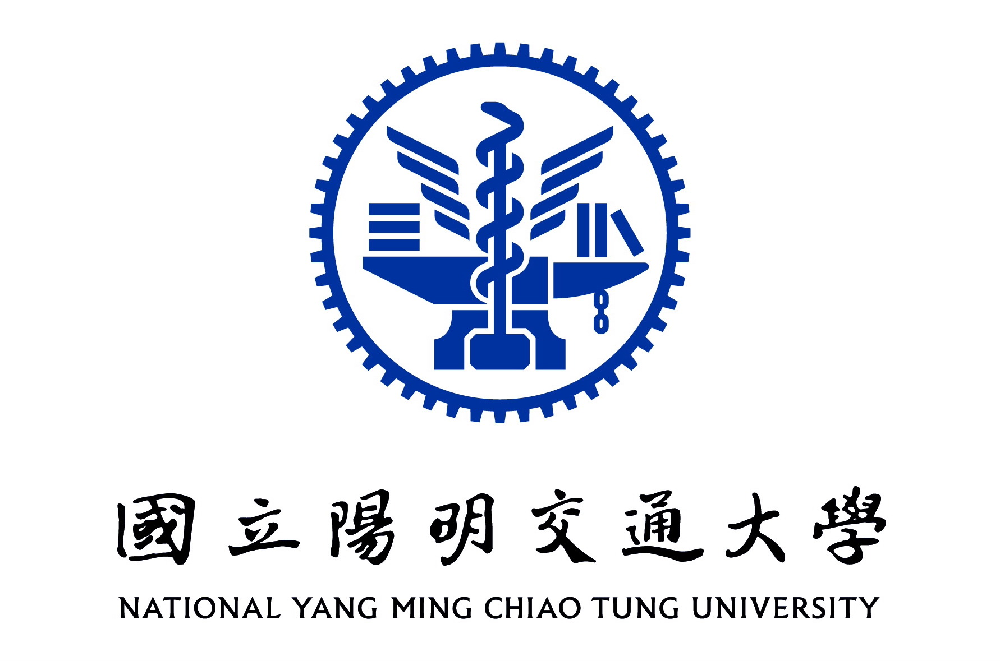
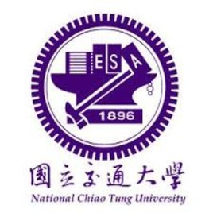
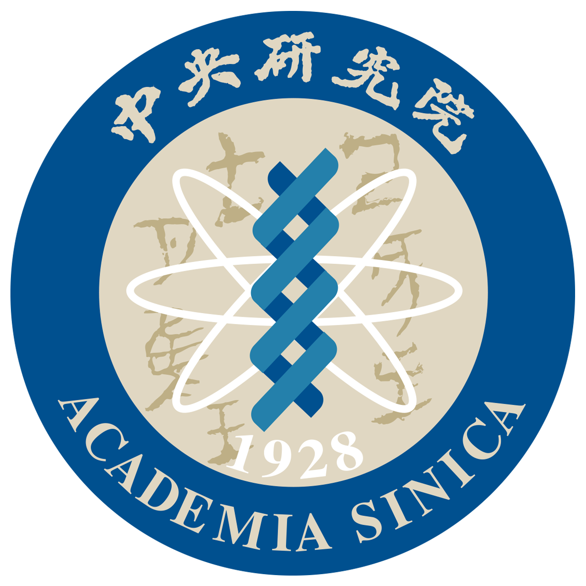
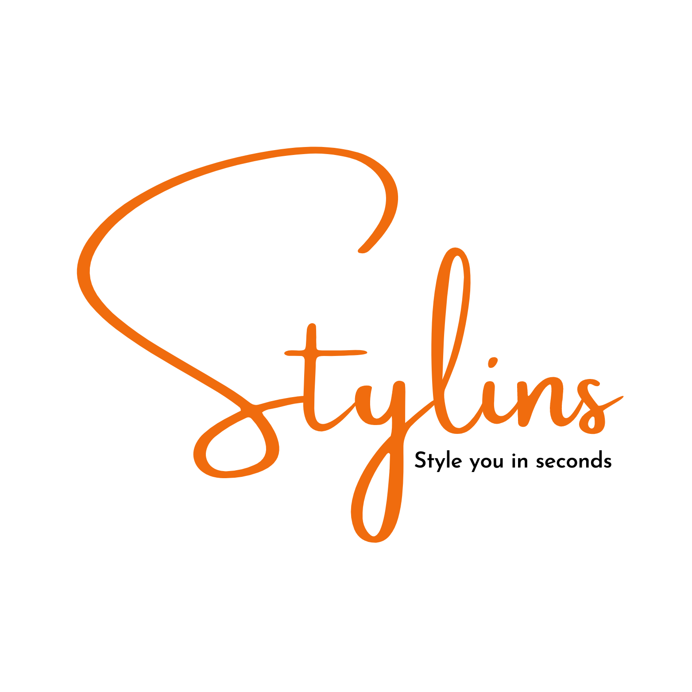
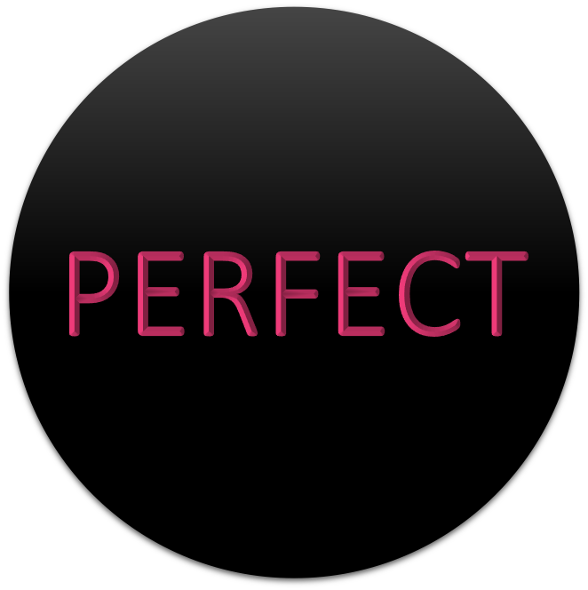

AI researcher, cooking interesting ideas. 

I received the MS from the Institute of Electronics at National (Yang Ming) Chiao Tung University in 2021, advised by [Prof. Wen-Huang Cheng](http://aimmlab.nctu.edu.tw/whcheng/index.html) and [Prof. Hong-Han Shuai](https://basiclab.lab.nycu.edu.tw/) and BS from the Department of Electrophysics at National Chiao Tung University in 2020. 

I am deeply passionate about generative AI, with a specific emphasis on Computer Vision and Image Synthesis and Editing. Throughout my research journey, I've been driven by the potential and transformative capabilities of these domains to create impactful and user-centric solutions.

My works have appeared in top-tier conferences and journals such as CVPR, ICCV, ACMMM, TNNLS, and ACM CSUR. I've served as the invited reviewer for CVPR, IEEE TNNLS, IEEE TMM, IEEE TCSVT, and ACM ToMM.

🤗 Feel free to contact me (<cychenisme@gmail.com>). I am open for cooperation!

<!-- A data-driven personal website -->

## Recent News 🔥
- [Aug. 2023] 🙏 Received ICCV Diversity, Equity & Inclusion Award with travel grant and free registration. Thanks ICCV’23 DEI Committee!
- [Jul. 2023] One co-first-author paper "[Size Does Matter: Size-aware Virtual Try-on via Clothing-oriented Transformation Try-on Network](https://openaccess.thecvf.com/content/ICCV2023/papers/Chen_Size_Does_Matter_Size-aware_Virtual_Try-on_via_Clothing-oriented_Transformation_Try-on_ICCV_2023_paper.pdf)" [[Code](https://github.com/cotton6/COTTON-size-does-matter)] got accepted at [ICCV](https://iccv2023.thecvf.com/home)! Let's meet at Paris 🇫🇷
- [Apr. 2023] Served as a reviewer for [TCSVT](https://ieeexplore.ieee.org/xpl/RecentIssue.jsp?punumber=76)
- [Mar. 2023] Served as a reviewer for [TOMM](https://dl.acm.org/journal/tomm)
- [Feb. 2023] Served as a reviewer for [TNNLS](https://ieeexplore.ieee.org/xpl/RecentIssue.jsp?punumber=5962385)
- [Nov. 2022] 🏆 Won the Excellent Award in [Mobilehero Networked Future Challenge ($1,950)](https://mobilehero.com/en/iot)
- [Jul. 2022] 🙏 Supported by the [Google for Startups Cloud Program ($2,000)](https://cloud.google.com/startup)
- [Jul. 2022] Served as a reviewer for [TMM](https://ieeexplore.ieee.org/xpl/RecentIssue.jsp?punumber=6046)
- [Jul. 2022] Served as a reviewer for [TCSVT](https://ieeexplore.ieee.org/xpl/RecentIssue.jsp?punumber=76)
- [May. 2022] 🙏 Supported by the [Center for Industry-Academia Collaboration (CIAC) of NYCU](https://en.flaps.ord.nycu.edu.tw/AboutUs/AboutUs) and [U-start Plan for Innovation and Entrepreneureship ($11,373)](https://ustart.yda.gov.tw)
- [Apr. 2022] 🙏 Supported by the [Garage+](https://garageplus.asia/en/)

<!-- - [Nov. 2021] Served as a reviewer for [TCSVT](https://ieeexplore.ieee.org/xpl/RecentIssue.jsp?punumber=76)
- [Aug. 2021] Served as a reviewer for [TOMM](https://dl.acm.org/journal/tomm)
- [Jul. 2021] Served as a reviewer for [TCSVT](https://ieeexplore.ieee.org/xpl/RecentIssue.jsp?punumber=76)
- [Jul. 2021] Served as a reviewer for [TMM](https://ieeexplore.ieee.org/xpl/RecentIssue.jsp?punumber=6046)
- [May. 2021] Served as a reviewer for [TOMM](https://dl.acm.org/journal/tomm)
- [Mar. 2021] Served as a reviewer for [TMM](https://ieeexplore.ieee.org/xpl/RecentIssue.jsp?punumber=6046)
- [Jan. 2021] Served as a reviewer for [TMM](https://ieeexplore.ieee.org/xpl/RecentIssue.jsp?punumber=6046) -->

## Education

<table style="width: 100%; border-collapse: collapse; border: 0;">
  <tr>
    <td style="width: 40%; border: 0px solid black; padding: 8px;">
      
    </td>
    <td style="border: 0px solid black; padding: 8px;"><strong style="font-size: 20px;">M.S., Institute of Electronics</strong>
     National Yang Ming Chiao Tung University in Taiwan
     Sep. 2020 - Jul. 2021
      <em> Accepted as the 1 year program with funding $1,300 </em>
    </td>
  </tr>
</table>

<table style="width: 100%; border-collapse: collapse; border: 0;">
  <tr>
    <td style="width: 40%; border: 0px solid black; padding: 8px;">
      
    </td>
    <td style="border: 0px solid black; padding: 8px;"><strong style="font-size: 20px;">B.S., Department of Electrophysics</strong>
     National Chiao Tung University @ Taiwan
     Sep. 2016 - Jun. 2020
      <em> Ranked the 1st place in class </em>
    </td>
  </tr>
</table>

## Awards
- **[Research] ICCV Diversity, Equity & Inclusion Award** with travel grant and free registration, 2023

- **[Startup] Excellent Award ($1,950)**, Mobilehero Networked Future Challenge, 2022

- **[Startup] Google for Startups Cloud Program ($2,000)**, Google Cloud, 2022

- **[Startup] U-start Plan for Innovation and Entrepreneurship ($11,373)**, Ministry of Education in Taiwan, 2022

- **[Research] Master Thesis Award**
  -  IEEE Taipei Section, 2021
  -  Institution of Engineering and Technology (IET), 2021
  -  Chinese Image Processing and Pattern Recognition Society (IPPR), 2021
  -  The Chinese Institute of Electrical Engineering (CIEE), 2021
  -  Taiwanese Association for Artificial Intelligence (TAAI), 2021
  -  Taiwan Association for Web Intelligence Consortium (WIC), 2021
  -  Institute of Information & Computing Machinery (IICM), 2021

- **[Research] Outstanding Student Research Reward ($1,550)**, National Yang Ming Chiao Tung University (NYCU), 2021

- **[Research] Future Tech Award ($325)**, Ministry of Science and Technology of Taiwan (MOST), 2021

- **[Research] The 1st Place Award** in the Image-based Multi-pose Virtual Try-on Challenge of the 4th Look Into Person (LIP) Challenge in IEEE Conference on Computer Vision and Pattern Recognition (CVPR), 2020  [[Oral Video](https://www.youtube.com/watch?v=zloK9g6RvYk)]

- **[Research] College Student Research Creativity Award ($2,200)**, Ministry of Science and Technology (MOST), 2020

- **[Research] Best Paper Award** in IPPR Conference on Computer Vision, Graphics, and Image Processing (CVGIP), 2019

## Work Experience

<table style="width: 100%; border-collapse: collapse; border: 0;">
  <tr>
    <td style="width: 40%; border: 0px solid black; padding: 8px;">
      
    </td>
    <td style="border: 0px solid black; padding: 8px;"><strong style="font-size: 20px;">Volunteer Research Assistant</strong>
     
    <a href="https://epoch.org.tw/en/" target="_blank">Epoch Foundation</a> in Taiwan
     Jul. 2023 - Present
    </td>
  </tr>
</table>

<table style="width: 100%; border-collapse: collapse; border: 0;">
  <tr>
    <td style="width: 40%; border: 0px solid black; padding: 8px;">
      
    </td>
    <td style="border: 0px solid black; padding: 8px;"><strong style="font-size: 20px;">Applied Scientist</strong>
     
    <a href="https://neurons-lab.com" target="_blank">Neurons Lab</a> in London
     Mar. 2023 - Present
    </td>
  </tr>
</table>

<table style="width: 100%; border-collapse: collapse; border: 0;">
  <tr>
    <td style="width: 40%; border: 0px solid black; padding: 8px;">
      
    </td>
    <td style="border: 0px solid black; padding: 8px;"><strong style="font-size: 20px;">Research Assistant</strong>
     
    <a href="https://www.nycu.edu.tw/nycu/en/index" target="_blank">National Yang Ming Chiao Tung University</a> in Taiwan
     Aug. 2023 - Present
    </td>
  </tr>
</table>

<table style="width: 100%; border-collapse: collapse; border: 0;">
  <tr>
    <td style="width: 40%; border: 0px solid black; padding: 8px;">
      
    </td>
    <td style="border: 0px solid black; padding: 8px;"><strong style="font-size: 20px;">Research Assistant</strong>
     
    <a href="https://www.sinica.edu.tw/en" target="_blank">Academia Sinica</a> in Taiwan
     Mar. 2023 - Jul. 2023
    </td>
  </tr>
</table>

<table style="width: 100%; border-collapse: collapse; border: 0;">
  <tr>
    <td style="width: 40%; border: 0px solid black; padding: 8px;">
      
    </td>
    <td style="border: 0px solid black; padding: 8px;"><strong style="font-size: 20px;">Founder & CEO</strong>
     
    <a href="https://stylins.ai/" target="_blank">Stylins.ai</a> in Taiwan
     Nov. 2021 - Feb. 2023
    </td>
  </tr>
</table>

<table style="width: 100%; border-collapse: collapse; border: 0;">
  <tr>
    <td style="width: 40%; border: 0px solid black; padding: 8px;">
      
    </td>
    <td style="border: 0px solid black; padding: 8px;"><strong style="font-size: 20px;">Machine Learning Engineer</strong>
     
    <a href="https://www.perfectcorp.com/business" target="_blank">Perfect Corp.</a> in Taiwan
     Sep. 2021 - Oct. 2021
    </td>
  </tr>
</table>

<table style="width: 100%; border-collapse: collapse; border: 0;">
  <tr>
    <td style="width: 40%; border: 0px solid black; padding: 8px;">
      
    </td>
    <td style="border: 0px solid black; padding: 8px;"><strong style="font-size: 20px;">Research Assistant</strong>
     
    <a href="https://aimm.lab.nycu.edu.tw/" target="_blank">AIMM Lab</a> in National Chiao Tung University in Taiwan
     Jul. 2021 - Aug. 2021
    </td>
  </tr>
</table>

<table style="width: 100%; border-collapse: collapse; border: 0;">
  <tr>
    <td style="width: 40%; border: 0px solid black; padding: 8px;">
      
    </td>
    <td style="border: 0px solid black; padding: 8px;"><strong style="font-size: 20px;">Student Researcher</strong>
     
    <a href="https://aimm.lab.nycu.edu.tw/" target="_blank">AIMM Lab</a> in National Chiao Tung University in Taiwan
     Jul. 2019 - Jun. 2021
    </td>
  </tr>
</table>