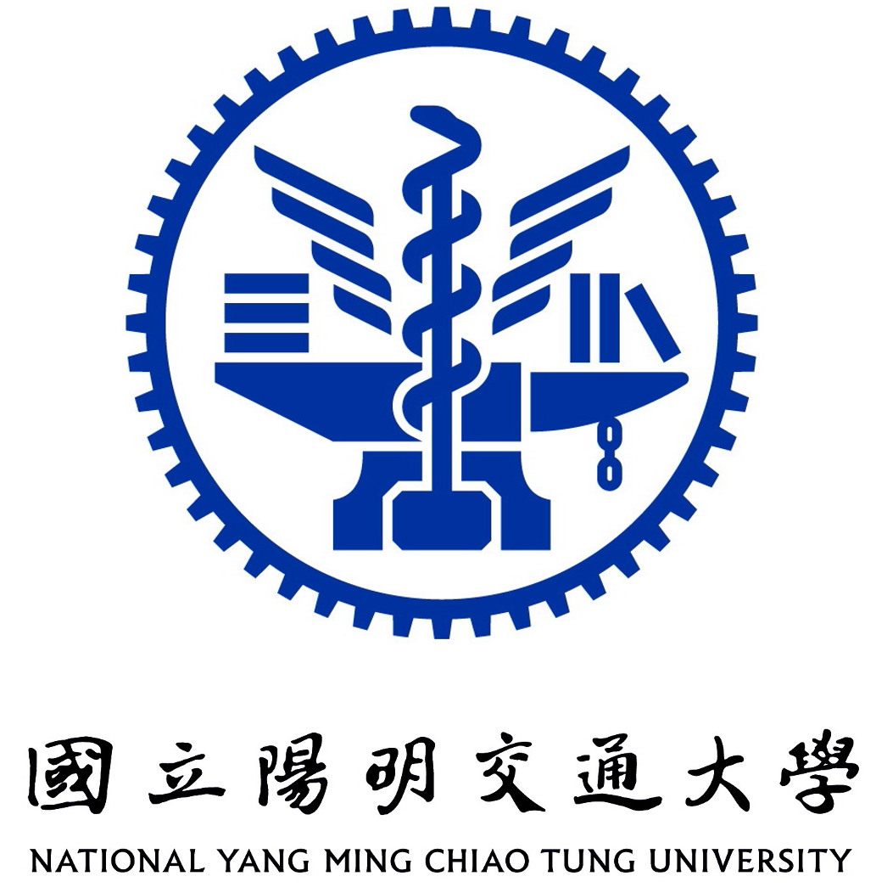

<!-- I received the MS from the Institute of Electronics at National (Yang Ming) Chiao Tung University in 2021, advised by [Prof. Wen-Huang Cheng](https://www.csie.ntu.edu.tw/~wenhuang/) and [Prof. Hong-Han Shuai](https://basiclab.lab.nycu.edu.tw/) and BS from the Department of Electrophysics at National Chiao Tung University in 2020.  -->

I am currently a Ph.D. student in Georgia Tech, advised by [Prof. Humphrey Shi](https://www.humphreyshi.com/), where I focus on user-centric tasks within Vision-related fields, i.e., agent, generative models. Previously, I earned my M.S. in 2021 and B.S. in 2020 from National Chiao Tung University, advised by [Prof. Wen-Huang Cheng](https://www.csie.ntu.edu.tw/~wenhuang/) and [Prof. Hong-Han Shuai](https://basiclab.lab.nycu.edu.tw/). Until 2023, my research focused on Image and Video Synthesis and Editing in Fashion, particularly Virtual Clothing Try-on.

I am deeply passionate about developing Artificial Machine Intelligence and leveraging its transformative potential to build impactful, user-centric businesses.

🤗 Feel free to contact me: 📩 [cychenisme@gmail.com](mailto:cychenisme@gmail.com). 
 Let's have a (virtual) coffee chat about interesting topics.

<!-- My works have been published in top-tier conferences and journals, including CVPR, ICCV, NeurIPS, ACMMM, TNNLS, and ACM CSUR. I have served as an invited reviewer for CVPR, ECCV, NeurIPS, IEEE TNNLS, IEEE TMM, IEEE TCSVT, and ACM ToMM. -->

<!-- A data-driven personal website -->

### Recent News 🔥
- [May 2025] Machine Learning Research Intern @ [Adobe FireFly](https://www.adobe.com/products/firefly.html)
- [Sep. 2024] One first-author paper "[A Cat Is A Cat (Not A Dog!): Unraveling Information Mix-ups in Text-to-Image Encoders through Causal Analysis and Embedding Optimization](http://arxiv.org/abs/2410.00321)" got accepted at [NeurIPS'24](https://neurips.cc/)! Let's meet at Vancouver 🇨🇦
- [Jun. 2024] I am excited to join the [SHI Labs](https://www.shi-labs.com/) as a Ph.D. student in Atlanta 🇺🇸
- [Jun. 2024] Served as a reviewer for 6 papers submitted to NeurIPS'24
- [Apr. 2024] One paper "[Artifact Does Matter! Low-artifact High-resolution Virtual Try-On via Diffusion-based Warp-and-Fuse Consistent Texture](https://basiclab.lab.nycu.edu.tw/assets/LA-VTON.pdf)" got the **Best Paper Runner-Up Award** at [CVPRW'24](https://sites.google.com/view/cvfad2024/home?authuser=0)! Welcome to chat with our team in Seattle 🇺🇸

<!-- - [Apr. 2024] Served as a reviewer for 4 papers submitted to ECCV'24 -->
<!-- - [Mar. 2024] Served as a reviewer for [TMM](https://ieeexplore.ieee.org/xpl/RecentIssue.jsp?punumber=6046) -->
<!-- - [Mar. 2024] Served as an emergency reviewer for 3 papers submitted to ICME'24 -->
<!-- - [Jan. 2024] Served as a reviewer for 6 papers submitted to CVPR'24 
- [Aug. 2023] 🙏 Received ICCV Diversity, Equity & Inclusion Award with travel grant and free registration. Thanks ICCV’23 DEI Committee!
- [Jul. 2023] One co-first-author paper "[Size Does Matter: Size-aware Virtual Try-on via Clothing-oriented Transformation Try-on Network](https://openaccess.thecvf.com/content/ICCV2023/papers/Chen_Size_Does_Matter_Size-aware_Virtual_Try-on_via_Clothing-oriented_Transformation_Try-on_ICCV_2023_paper.pdf)" [[Code](https://github.com/cotton6/COTTON-size-does-matter)] got accepted at [ICCV](https://iccv2023.thecvf.com/home)! Let's meet at Paris 🇫🇷 -->

<!-- - [Apr. 2023] Served as a reviewer for [TCSVT](https://ieeexplore.ieee.org/xpl/RecentIssue.jsp?punumber=76)
- [Mar. 2023] Served as a reviewer for [TOMM](https://dl.acm.org/journal/tomm)
- [Feb. 2023] Served as a reviewer for [TNNLS](https://ieeexplore.ieee.org/xpl/RecentIssue.jsp?punumber=5962385)
- [Nov. 2022] 🏆 Won the Excellent Award in [Mobilehero Networked Future Challenge ($1,950)](https://mobilehero.com/en/iot)
- [Jul. 2022] 🙏 Supported by the [Google for Startups Cloud Program ($2,000)](https://cloud.google.com/startup)
- [Jul. 2022] Served as a reviewer for [TMM](https://ieeexplore.ieee.org/xpl/RecentIssue.jsp?punumber=6046)
- [Jul. 2022] Served as a reviewer for [TCSVT](https://ieeexplore.ieee.org/xpl/RecentIssue.jsp?punumber=76)
- [May. 2022] 🙏 Supported by the [Center for Industry-Academia Collaboration (CIAC) of NYCU](https://en.flaps.ord.nycu.edu.tw/AboutUs/AboutUs) and [U-start Plan for Innovation and Entrepreneureship ($11,373)](https://ustart.yda.gov.tw)
- [Apr. 2022] 🙏 Supported by the [Garage+](https://garageplus.asia/en/) -->

<!-- - [Nov. 2021] Served as a reviewer for [TCSVT](https://ieeexplore.ieee.org/xpl/RecentIssue.jsp?punumber=76)
- [Aug. 2021] Served as a reviewer for [TOMM](https://dl.acm.org/journal/tomm)
- [Jul. 2021] Served as a reviewer for [TCSVT](https://ieeexplore.ieee.org/xpl/RecentIssue.jsp?punumber=76)
- [Jul. 2021] Served as a reviewer for [TMM](https://ieeexplore.ieee.org/xpl/RecentIssue.jsp?punumber=6046)
- [May. 2021] Served as a reviewer for [TOMM](https://dl.acm.org/journal/tomm)
- [Mar. 2021] Served as a reviewer for [TMM](https://ieeexplore.ieee.org/xpl/RecentIssue.jsp?punumber=6046)
- [Jan. 2021] Served as a reviewer for [TMM](https://ieeexplore.ieee.org/xpl/RecentIssue.jsp?punumber=6046) -->

### Awards
- **[Research] NeurIPS Scholar Award**, 2024
- **[Research] ICCV Diversity, Equity & Inclusion Award** with travel grant and free registration, 2023
- **[Startup] Excellent Award ($1,950)**, Mobilehero Networked Future Challenge, 2022
- **[Startup] Google for Startups Cloud Program ($2,000)**, Google Cloud, 2022
- **[Startup] U-start Plan for Innovation and Entrepreneurship ($11,373)**, Ministry of Education in Taiwan, 2022
- **[Research] Master Thesis Award**
  -  IEEE Taipei Section, 2021
  -  Institution of Engineering and Technology (IET), 2021
  -  Chinese Image Processing and Pattern Recognition Society (IPPR), 2021
  -  The Chinese Institute of Electrical Engineering (CIEE), 2021
  -  Taiwanese Association for Artificial Intelligence (TAAI), 2021
  -  Taiwan Association for Web Intelligence Consortium (WIC), 2021
  -  Institute of Information & Computing Machinery (IICM), 2021
- **[Research] Outstanding Student Research Reward ($1,550)**, National Yang Ming Chiao Tung University (NYCU), 2021
- **[Research] Future Tech Award ($325)**, Ministry of Science and Technology of Taiwan (MOST), 2021
- **[Research] The 1st Place Award** in the Image-based Multi-pose Virtual Try-on Challenge of the 4th Look Into Person (LIP) Challenge in IEEE Conference on Computer Vision and Pattern Recognition (CVPR), 2020  [[Oral Video](https://www.youtube.com/watch?v=zloK9g6RvYk)]
- **[Research] College Student Research Creativity Award ($2,200)**, Ministry of Science and Technology (MOST), 2020
- **[Research] Best Paper Award** in IPPR Conference on Computer Vision, Graphics, and Image Processing (CVGIP), 2019

### Work Experience

<!-- <table style="width: 100%; border-collapse: collapse; border: 0;">
  <tr>
    <td style="width: 18%; border: 0px solid black; padding: 8px;">
      
    </td>
    <td style="border: 0px solid black; padding: 8px;"><strong style="font-size: 18px;">Volunteer Research Assistant</strong>
     
    <a href="https://www.shi-labs.com/" target="_blank">SHI Labs</a> in <a href="https://www.gatech.edu/" target="_blank"> Georgia Tech</a> in Atlanta 🇺🇸
     Jun. 2024 - Present
    </td>
  </tr>
</table> -->

<table style="width: 100%; border-collapse: collapse; border: 0;">
  <tr>
    <td style="width: 18%; border: 0px solid black; padding: 8px;">
      
    </td>
    <td style="border: 0px solid black; padding: 8px;"><strong style="font-size: 18px;">Teaching Assistant</strong>
     
    <a href="https://www.gatech.edu/" target="_blank"> Georgia Tech</a> in Atlanta 🇺🇸
     
      [Spring 2025]
      
          <a href="https://docs.google.com/spreadsheets/d/e/2PACX-1vQdFbC7_8UEsS_UkKhAmKfYgO5SnhQ_9YIn5WRxz_9KxmOzeWF32ApdLeA32yRkDDIz_Sb_4zK2HvKU/pubhtml#" target="_blank">OMSCS 6476 Computer Vision</a>
      
       
      [Fall 2024]
      
          <a href="https://www.humphreyshi.com/vision" target="_blank">CS 6476 Computer Vision</a>
      
    </td>
  </tr>
</table>

<table style="width: 100%; border-collapse: collapse; border: 0;">
  <tr>
    <td style="width: 18%; border: 0px solid black; padding: 8px;">
      
    </td>
    <td style="border: 0px solid black; padding: 8px;"><strong style="font-size: 18px;">Research Assistant</strong>
     
    <a href="https://epoch.org.tw/en/" target="_blank">Epoch Foundation</a> in Taiwan 🇹🇼
     Jul. 2023 - Jun. 2024
    </td>
  </tr>
</table>

<table style="width: 100%; border-collapse: collapse; border: 0;">
  <tr>
    <td style="width: 18%; border: 0px solid black; padding: 12px;">
      
    </td>
    <td style="border: 0px solid black; padding: 8px;"><strong style="font-size: 18px;">Research Assistant</strong>
      <a href="https://basiclab.lab.nycu.edu.tw/new/index.html" target="_blank">Basic Lab</a> in <a href="https://www.nycu.edu.tw/nycu/en/index" target="_blank">National Yang Ming Chiao Tung University</a> in Taiwan 🇹🇼
     Aug. 2023 - Jun. 2024
    </td>
  </tr>
</table>

<table style="width: 100%; border-collapse: collapse; border: 0;">
  <tr>
    <td style="width: 18%; border: 0px solid black; padding: 12px;">
      
    </td>
    <td style="border: 0px solid black; padding: 8px;"><strong style="font-size: 18px;">Research Assistant</strong>
      <a href="https://basiclab.lab.nycu.edu.tw/new/index.html" target="_blank">Basic Lab</a> in 
    <a href="https://www.sinica.edu.tw/en" target="_blank">Academia Sinica</a> in Taiwan 🇹🇼
     Mar. 2023 - Jul. 2023
    </td>
  </tr>
</table>

<table style="width: 100%; border-collapse: collapse; border: 0;">
  <tr>
    <td style="width: 18%; border: 0px solid black; padding: 12px;">
      
    </td>
    <td style="border: 0px solid black; padding: 8px;"><strong style="font-size: 18px;">Applied Scientist</strong>
     
    <a href="https://neurons-lab.com" target="_blank">Neurons Lab</a> in London 🇬🇧
     Mar. 2023 - Mar. 2024
    </td>
  </tr>
</table>

<table style="width: 100%; border-collapse: collapse; border: 0;">
  <tr>
    <td style="width: 18%; border: 0px solid black; padding: 8px;">
      
    </td>
    <td style="border: 0px solid black; padding: 8px;"><strong style="font-size: 18px;">Founder & CEO</strong>
     
    <a href="https://stylins.ai/" target="_blank">Stylins.ai</a> in Taiwan 🇹🇼
     Nov. 2021 - Feb. 2023
    </td>
  </tr>
</table>

<table style="width: 100%; border-collapse: collapse; border: 0;">
  <tr>
    <td style="width: 18%; border: 0px solid black; padding: 12px;">
      
    </td>
    <td style="border: 0px solid black; padding: 8px;"><strong style="font-size: 18px;">Machine Learning Engineer</strong>
     
    <a href="https://www.perfectcorp.com/business" target="_blank">Perfect Corp.</a> in Taiwan 🇹🇼
     Sep. 2021 - Oct. 2021
    </td>
  </tr>
</table>
<!-- 
<table style="width: 100%; border-collapse: collapse; border: 0;">
  <tr>
    <td style="width: 18%; border: 0px solid black; padding: 8px;">
      
    </td>
    <td style="border: 0px solid black; padding: 8px;"><strong style="font-size: 18px;">Research Assistant</strong>
     
    <a href="https://aimm.lab.nycu.edu.tw/" target="_blank">AIMM Lab</a> in National Chiao Tung University in Taiwan 🇹🇼
     Jul. 2021 - Aug. 2021
    </td>
  </tr>
</table> -->

<!-- <table style="width: 100%; border-collapse: collapse; border: 0;">
  <tr>
    <td style="width: 18%; border: 0px solid black; padding: 8px;">
      
    </td>
    <td style="border: 0px solid black; padding: 8px;"><strong style="font-size: 18px;">Student Researcher</strong>
     
    <a href="https://aimm.lab.nycu.edu.tw/" target="_blank">AIMM Lab</a> in National Chiao Tung University in Taiwan 🇹🇼
     Jul. 2019 - Jun. 2021
    </td>
  </tr>
</table> -->

### Education

<table style="width: 100%; border-collapse: collapse; border: 0;">
  <tr>
    <td style="width: 18%; border: 0px solid black; padding: 8px;">
      
    </td>
    <td style="border: 0px solid black; padding: 8px;"><strong style="font-size: 18px;">Ph.D., School of Interactive Computing</strong>
     
    Georgia Institute of Technology in United States
     Aug. 2024 - Present
    </td>
  </tr>
</table>

<table style="width: 100%; border-collapse: collapse; border: 0;">
  <tr>
    <td style="width: 18%; border: 0px solid black; padding: 12px;">
      
    </td>
    <td style="border: 0px solid black; padding: 8px;"><strong style="font-size: 18px;">M.S., Institute of Electronics</strong>
     National Yang Ming Chiao Tung University in Taiwan
     Sep. 2020 - Jul. 2021
      <em> Accepted as the 1 year program with funding $1,300 </em>
    </td>
  </tr>
</table>

<table style="width: 100%; border-collapse: collapse; border: 0;">
  <tr>
    <td style="width: 18%; border: 0px solid black; padding: 8px;">
      
    </td>
    <td style="border: 0px solid black; padding: 8px;"><strong style="font-size: 18px;">B.S., Department of Electrophysics</strong>
     National Chiao Tung University @ Taiwan
     Sep. 2016 - Jun. 2020
      <em> Ranked the 1st place in class </em>
    </td>
  </tr>
</table>