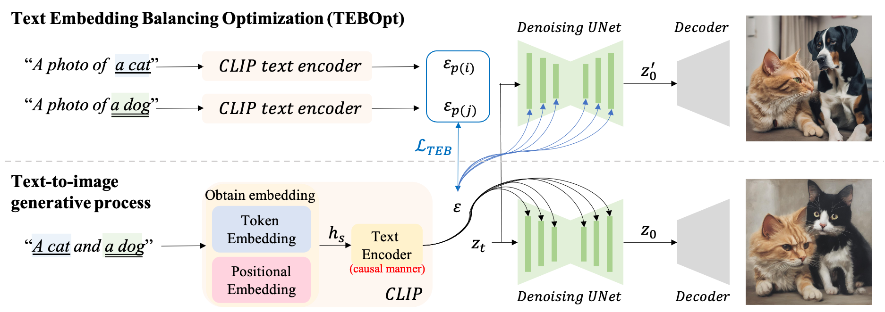
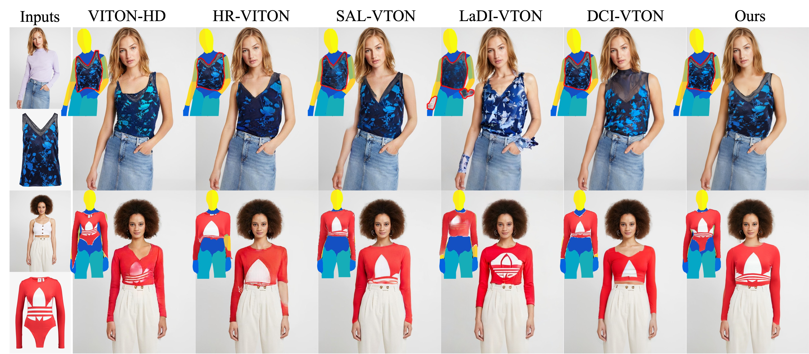

## Publications

<table style="width: 100%; border-collapse: collapse; border: 0;">
  <tr>
    <td style="width: 40%; border: 0px solid black; padding: 8px;">
      
    </td>
    <td style="border: 0px solid black; padding: 8px;"><strong style="font-size: 20px;">A Cat Is A Cat (Not A Dog!): Unraveling Information Mix-ups in Text-to-Image Encoders through Causal Analysis and Embedding Optimization</strong>
     <strong>Chieh-Yun Chen</strong>, Chiang Tseng, Li-Wu Tsao, and Hong-Han Shuai 
     <em>The Thirty-Eighth Annual Conference on Neural Information Processing Systems (NeurIPS), 2024 </em>
      <a href="https://arxiv.org/pdf/2410.00321" target="_blank">Paper</a> | 
      <a href="https://github.com/basiclab/Unraveling-Information-Mix-ups" target="_blank">Code</a> | 
      <a href="https://neurips.cc/virtual/2024/poster/94705" target="_blank">Website</a> | 
      <a href="https://recorder-v3.slideslive.com/?share=93216&s=59c83ce6-deaf-4f6d-8e89-3bf9eb5a0e0d" target="_blank">Video</a> 
    </td>
  </tr>
</table>

<table style="width: 100%; border-collapse: collapse; border: 0;">
  <tr>
    <td style="width: 40%; border: 0px solid black; padding: 8px;">
      
    </td>
    <td style="border: 0px solid black; padding: 8px;"><strong style="font-size: 20px;">Artifact Does Matter! Low-artifact High-resolution Virtual Try-On via Diffusion-based Warp-and-Fuse Consistent Texture</strong>
     Chiang Tseng, <strong>Chieh-Yun Chen</strong>, and Hong-Han Shuai 
     <a href="https://sites.google.com/view/cvfad2024/home?authuser=0" target="_blank"><em>The 7th Workshop on Computer Vision for Fashion, Art, and Design in IEEE/CVF Conference on Computer Vision and Pattern Recognition (CVPRW), 2024 </em></a> 
      Runner-Up of the Best Paper Award  
      <a href="https://basiclab.lab.nycu.edu.tw/assets/LA-VTON.pdf" target="_blank">Paper</a> | 
      <a href="https://drive.google.com/file/d/1NqLnynUmvxfQJ2BGDnxXMauj8vkFIxsS/view" target="_blank">Poster</a> | 
      <a href="https://drive.google.com/file/d/1FtbpFA0QIetjgHjpviUwlfCXjUAtVLad/view" target="_blank">Video</a>
    </td>
  </tr>
</table>

<table style="width: 100%; border-collapse: collapse; border: 0;">
  <tr>
    <td style="width: 40%; border: 0px solid black; padding: 8px;">
      
    </td>
    <td style="border: 0px solid black; padding: 8px;"><strong style="font-size: 20px;">Size Does Matter: Size-aware Virtual Try-on via Clothing-oriented Transformation Try-on Network</strong>
     <strong>*Chieh-Yun Chen</strong>, *Yi-Chung Chen, Hong-Han Shuai, and Wen-Huang Cheng (*Equal contribution) 
     <em>International Comference on Computer Vision (ICCV), 2023 </em>
      <a href="https://openaccess.thecvf.com/content/ICCV2023/papers/Chen_Size_Does_Matter_Size-aware_Virtual_Try-on_via_Clothing-oriented_Transformation_Try-on_ICCV_2023_paper.pdf" target="_blank">Paper</a> | 
      <a href="https://github.com/cotton6/COTTON-size-does-matter" target="_blank">Code</a> | 
      <a href="https://drive.google.com/file/d/1Q0akJasw3Z3O-4YECa-4GkUs-A-pv9pr/view?usp=sharing" target="_blank">Poster</a>
    </td>
  </tr>
</table>

<table style="width: 100%; border-collapse: collapse; border: 0;">
  <tr>
    <td style="width: 40%; border: 0px solid black; padding: 8px;">
      
    </td>
    <td style="border: 0px solid black; padding: 8px;"><strong style="font-size: 20px;">FashionMirror: Co-attention Feature-remapping Virtual Try-on with Sequential Template Poses</strong>
     <strong>Chieh-Yun Chen</strong>, Ling Lo, Pin-Jui Huang, Hong-Han Shuai, and Wen-Huang Cheng 
     <em>International Comference on Computer Vision (ICCV), 2021 | Oral, oral acceptance rate=3% </em>
      <a href="https://openaccess.thecvf.com/content/ICCV2021/papers/Chen_FashionMirror_Co-Attention_Feature-Remapping_Virtual_Try-On_With_Sequential_Template_Poses_ICCV_2021_paper.pdf" target="_blank">Paper</a> | <a href="https://openaccess.thecvf.com/content/ICCV2021/supplemental/Chen_FashionMirror_Co-Attention_Feature-Remapping_ICCV_2021_supplemental.pdf" target="_blank">Supplements</a> | 
      <a href="https://youtu.be/1qPQWZmUbow" target="_blank">Oral Video</a> | <a href="https://drive.google.com/file/d/1Vu8Zjep70aUS9eaUveDyuXK9o-N5dAzn/view?usp=sharing" target="_blank">Poster</a> | 
      <a href="https://github.com/FashionMirror/FashionMirror" target="_blank">Demo</a>
    </td>
  </tr>
</table>

<table style="width: 100%; border-collapse: collapse; border: 0;">
  <tr>
    <td style="width: 40%; border: 0px solid black; padding: 8px;">
      
    </td>
    <td style="border: 0px solid black; padding: 8px;"><strong style="font-size: 20px;">Fashion Meets Computer Vision: A Survey</strong>
     Wen-Huang Cheng, Sijie Song, <strong>Chieh-Yun Chen</strong>, Shintami Chusnul Hidayati, and Jiaying Liu
     <em>ACM Computing Surveys (ACM CSUR), 2021 </em>
      <a href="https://dl.acm.org/doi/pdf/10.1145/3447239" target="_blank">Paper</a>
    </td>
  </tr>
</table>

<table style="width: 100%; border-collapse: collapse; border: 0;">
  <tr>
    <td style="width: 40%; border: 0px solid black; padding: 8px;">
      
    </td>
    <td style="border: 0px solid black; padding: 8px;"><strong style="font-size: 20px;">Template-free Try-on Image Synthesis via Semantic-guided Optimization</strong>
     Chien-Lung Chou, <strong>Chieh-Yun Chen</strong>, Chia-Wei Hsieh, Hong-Han Shuai, Jiaying Liu, and Wen-Huang Cheng
     <em>IEEE Transactions on Neural Networks and Learning Systems (TNNLS), 2021 </em>
      <a href="https://arxiv.org/pdf/2102.03503.pdf" target="_blank">Paper</a>
    </td>
  </tr>
</table>

<table style="width: 100%; border-collapse: collapse; border: 0;">
  <tr>
    <td style="width: 40%; border: 0px solid black; padding: 8px;">
      
    </td>
    <td style="border: 0px solid black; padding: 8px;"><strong style="font-size: 20px;">FashionOn: Semantic-guided Image-based Virtual Try-on with Detailed Human and Clothing Information</strong>
     *Chia-Wei Hsieh, <strong>*Chieh-Yun Chen</strong>, *Chien-Lung Chou, Hong-Han Shuai, Jiaying Liu, and Wen-Huang Cheng  (*Equal contribution)
     <em>ACM International Conference on Multimedia (ACM MM), 2019 | Oral, acceptance rate=26.5% </em>
      <a href="http://39.96.165.147/Pub%20Files/2019/hcw_mm19.pdf" target="_blank">Paper</a>
    </td>
  </tr>
</table>

<table style="width: 100%; border-collapse: collapse; border: 0;">
  <tr>
    <td style="width: 40%; border: 0px solid black; padding: 8px;">
      
    </td>
    <td style="border: 0px solid black; padding: 8px;"><strong style="font-size: 20px;">Fit-me: Image-based virtual try-on with arbitrary poses</strong>
     Chia-Wei Hsieh, <strong>Chieh-Yun Chen</strong>, Chien-Lung Chou, Hong-Han Shuai, and Wen-Huang Cheng
     <em>International Conference on Image Processing (ICIP), 2019 </em>
      <a href="https://ieeexplore.ieee.org/document/8803681" target="_blank">Paper</a>
    </td>
  </tr>
</table>

## Talk

<table style="width: 100%; border-collapse: collapse; border: 0;">
  <tr>
    <td style="width: 40%; border: 0px solid black; padding: 8px;">
      
    </td>
    <td style="border: 0px solid black; padding: 8px;"><strong style="font-size: 20px;">Winner Talk for Image-based Multi-pose Virtual Try-on Challenge</strong>
     <strong>Chieh-Yun Chen</strong>, Hong-Han Shuai, and Wen-Huang Cheng
     <em>CVPR 2020 Workshop on Towards Human-Centric Image/Video Synthesis,  and the 4th Look Into Person (LIP) Challenge </em>
      <a href="https://www.youtube.com/watch?v=zloK9g6RvYk" target="_blank">Video</a>
    </td>
  </tr>
</table>

## Academic Services

- Conference Reviewer
  CVPR'24; ECCV'24; ICCV'25; NeurIPS'24; ICML'25; ICME'24
  <!-- * IEEE/CVF Conference on Computer Vision and Pattern Recognition (CVPR): 2024
  * The European Conference on Computer Vision (ECCV): 2024
  * The Conference on Neural Information Processing Systems (NeurIPS): 2024
  * International Conference on Machine Learning (ICML): 2025
  * IEEE International Conference on Multimedia and Expo (ICME): 2024  -->

- Journal Reviewer
  TNNLS'23; TCSVT'21,22,23; TOMM'21,23; TMM'21,22,24

  <!-- * IEEE Transactions on Neural Networks and Learning Systems (TNNLS): 2023
  * IEEE Transactions on Circuits and Systems for Video Technology (TCSVT): 2021, 2022, 2023
  * ACM Transactions on Multimedia Computing, Communications, and Applications (TOMM): 2021, 2023
  * IEEE Transactions on Multimedia (TMM): 2021, 2022, 2024 -->

- Teaching Assistant
  * [OMSCS6476 Computer Vision](https://docs.google.com/spreadsheets/d/e/2PACX-1vQdFbC7_8UEsS_UkKhAmKfYgO5SnhQ_9YIn5WRxz_9KxmOzeWF32ApdLeA32yRkDDIz_Sb_4zK2HvKU/pubhtml), Spring 2025, Georgia Institute of Technology
  Instructor: Prof. Irfan Essa

  * [CS6476 Computer Vision](https://www.humphreyshi.com/vision), Fall 2024, Georgia Institute of Technology
  Instructor: Prof. Humphrey Shi

  * IEE5741 [Applied Computer Vision](https://timetable.nycu.edu.tw/?r=main/crsoutline&Acy=110&Sem=1&CrsNo=5043&lang=zh-tw) [English Medium Course], Fall 2020, National Chiao Tung University
  Instructor: Prof. Wen-Huang Cheng

- Mentorship
  * [Project TYRA (Taiwanese Young Researcher Association)](https://sites.google.com/view/projecttyra/home), Fall 2025
    Mentoring 1 Taiwanese student to apply for PhD program in USA (Admitted to UT Austin)